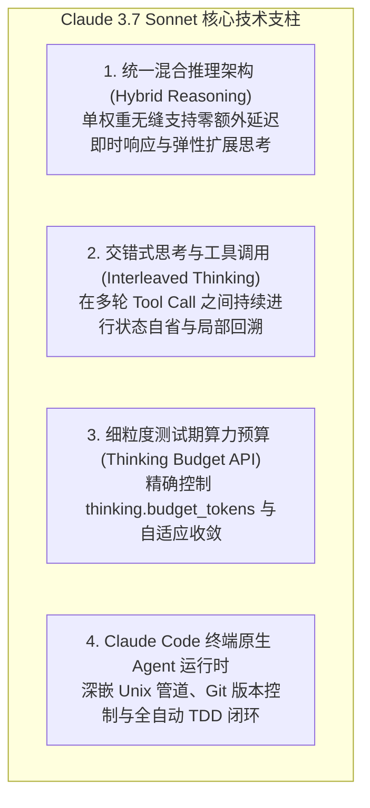
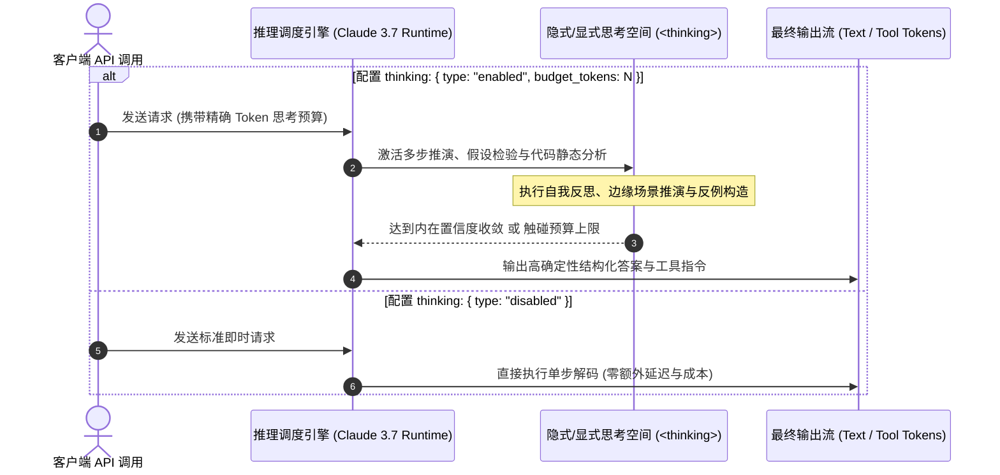

> **评估对象**：*Claude 3.7 Sonnet System Card & Technical Evaluation Report*  
> **发布机构**：Anthropic  
> **核心定位**：业界首个原生混合推理模型（Hybrid Reasoning Model，单权重无缝融合标准低延迟推断与动态扩展思维链）  
> **伴生工具**：Claude Code（终端原生 Agentic 软件工程运行时）  
> **文档性质**：系统架构深度解构、测试期算力扩展（Test-Time Compute）与 Agent 运行时工程评估报告  

---

## 1. 概述与核心范式演进

在以往的大模型推理架构中，业界普遍存在**“快速响应”与“深度推理”二元对立**的工程割裂：
- **标准即时模型（Standard Fast Models）**（如 Claude 3.5 Sonnet、GPT-4o）：采用直接单步自回归解码，首字时延（TTFT）极低，但在面对多文件跨仓库重构、高阶竞赛数学推导与长程 Agent 决策时，受限于单 Token 固定算力，极易发生逻辑漂移与幻觉；
- **纯长思维链推理模型（Pure Reasoning Models）**（如 OpenAI o1/o3-mini、DeepSeek-R1）：虽能通过扩展测试期算力（Test-Time Compute）提升逻辑上限，但强制对全量请求开启完整思维链，不仅在简单任务上产生严重的延迟与 Token 成本浪费，且其思维链通常为只读黑盒，无法与外部工具环境形成细粒度交错闭环。

Anthropic 正式发布的 **Claude 3.7 Sonnet** 彻底打破了这一边界，成为**业界首个在单一基座模型权重内实现原生混合推理（Hybrid Reasoning）的前沿旗舰大模型**。



---

## 2. 核心系统架构与技术机制深度拆解

### 2.1 原生混合推理引擎：单权重内部的动态算力分配

与常见的“利用外部轻量级 Router 在快慢两个独立模型间做分流”的工程妥协不同，Claude 3.7 Sonnet 是一个**统一的 Transformer 基座模型**。它在后训练强化学习（RL）阶段融合了多任务验证目标，使模型能够感知自身的认知置信度，并在同一模型权重内自由切换推理深度。



#### 测试期算力扩展（Test-Time Compute Scaling）的连续控制
通过在 API 中引入 `thinking.budget_tokens` 参数，开发者可以精确控制模型用于内部推演的最大 Token 数量（支持从 1024 到数万 Tokens）。

$$\text{Accuracy}(B) = \mathcal{A}_{\infty} - \frac{\mathcal{C}}{(B + B_0)^\alpha}, \quad \alpha > 0$$

这一机制使得开发者能够在 **时延敏感型交互（如聊天机器人、UI 自动补全）** 与 **正确性严苛型任务（如形式化验证、核心业务代码审计）** 之间，沿着 Pareto 最优前沿做出精准的工程权衡。

---

### 2.2 交错式 Agent 思考与工具调用闭环（Interleaved Thinking）

传统推理模型在执行 Agent 工具调用（如 Bash、文件读写、数据库检索）时，最大的软肋在于**“一次性规划脱节”**：模型在执行第一个工具调用前输出完整的推理链，之后仅仅盲目执行工具序列，一旦工具执行抛出非预期异常（如语法错误、测试用例不通过），模型便失去纠错能力。

Claude 3.7 Sonnet 首次实现了原生的**交错式思考运行时（Interleaved Thinking & Tool Calling）**：


#### 工程优势：
1. **闭环自省与状态回溯（Backtracking）**：每次收到环境返回的 `tool_result`，模型立即在内部进入下一轮思考，评估当前工具调用的实际副作用，并在发现偏离预期时主动回退到分支假设，重新规划；
2. **长程软件工程任务中的上下文保真**：在跨数十轮工具调用的复杂场景中，交错思考充当了**动态工作记忆（Dynamic Working Memory）的提炼器**，彻底杜绝了模型在长时运行中的注意力稀释（Attention Dilution）。

---

### 2.3 Claude Code：终端原生 Agentic 软件工程基础设施

伴随 Claude 3.7 Sonnet 的发布，Anthropic 正式推出了 **Claude Code** —— 一款直接嵌入开发者终端环境的 Agentic 编程基础设施。

```text
Developer Terminal
└── claude-code CLI
    ├── Context Engine: 扫描项目 AST、Git 变更与 .gitignore
    ├── Execution Harness: 交互式审查与自动化 Bash/Test 执行
    ├── Memory Buffer: 多轮 Tool Call 状态机维护
    └── API Gateway: 与 Claude 3.7 Sonnet 的流式通信 (支持 Prompt Caching)
```

- **Unix 哲学与本地工具收敛**：放弃了重型沙箱包装，直接利用终端原生原子工具（`read`, `edit`, `write`, `bash`）进行文件检索、代码修改与命令执行；
- **测试驱动开发（TDD）自主循环**：能够自主编写单元测试、运行测试套件、根据失败堆栈迭代修复源码，直至测试全绿；
- **Git 与版本控制无缝集成**：支持自动读取 Git Diff、分析冲突原因，并在任务结束时自动生成规范的 Commit Message 与 PR 摘要。

---

### 2.4 字节级前缀缓存（Prompt Caching）与系统吞吐优化

在支持 200,000 Token 上下文与长程多轮思考时，Prefill 计算与显存带宽往往成为性能杀手。Claude 3.7 深度优化了字节级前缀缓存机制：

```
[System Instructions] -> [Tool Definitions (JSON Schema)] -> [Repository Files] -> [Turn History]
└────────────────────────── 命中 5min 动态 KV 缓存 (降费 90% / 首字延迟降低 85%) ──────────────────────────┘
```

- **显式缓存边界**：开发者可通过 `cache_control: { type: "ephemeral" }` 显式划分静态系统提示词与动态思考流；
- **分层静态保序**：静态上下文严格前置，动态生成的思维链与用户输入后置，确保多轮代码重构中 95% 以上的 KV 缓存命中率。

---

## 3. 基准测试评估与工程实测对比

在涵盖真实软件工程、多步业务流与竞赛级逻辑推理的权威测试集上，Claude 3.7 Sonnet 展示出标杆级表现：

| 评估基准 / Benchmark | 测试领域与维度 | Claude 3.5 Sonnet | Claude 3.7 Sonnet (Standard Mode) | Claude 3.7 Sonnet (Extended Thinking) | 核心架构优势 |
| :--- | :--- | :--- | :--- | :--- | :--- |
| **SWE-bench Verified** | 真实 GitHub Issue 自动化修复 | 49.2% | 55.4% | **70.3%** | 交错式思考闭环与深度自主调试能力 |
| **TAU-bench (Airline / Retail)** | 复杂真实商业规则下的多工具 Agent 决策 | 46.0% | 52.8% | **81.2%** | 测试期算力扩展确保了复杂逻辑分支的零遗漏 |
| **AIME (竞赛数学)** | 高阶数学逻辑推演 | 38.0% | 54.2% | **84.5%** | 思考预算充足时，模型能进行完整的符号逆向推导 |
| **GPQA Diamond** | 跨学科博士级高难度科学问答 | 65.0% | 71.8% | **82.4%** | 混合架构消除了单步直觉解码的认知盲区 |

---

## 4. 系统工程权衡与生产部署边界

从严谨的工程落地视角审视，Claude 3.7 混合推理模式同样对生产系统的架构设计提出了全新要求：

| 挑战维度 | 典型系统瓶颈 | 生产环境应对策略 |
| :--- | :--- | :--- |
| **思考预算与成本开销** | 极度复杂任务下单次请求可消耗数万 Thinking Tokens | 必须在 API 网关层根据任务类型建立动态分流规则，对常规任务禁用或限制 `budget_tokens`。 |
| **端到端延迟与用户体验** | 深度思考模式下首字时间（TTFT）延长至数秒甚至数十秒 | 客户端必须强制支持流式传输（Streaming），将 `<thinking>` 内部思考过程通过折叠动效实时呈现。 |
| **KV Cache 显存压力** | 长期交错工具交互会导致上下文迅速累积 | 必须结合 Prompt Caching 与定期的会话滑动压实（Compaction）策略控制总长度。 |

---

## 5. 总结与技术演进结论

Claude 3.7 Sonnet 的发布确立了大语言模型架构演进的三个核心方向：

1. **混合推理是大模型架构的必然演进**：将“即时响应”与“深度思考”融合在单一权重中，赋予了模型类似人类大脑在系统 1（快思考）与系统 2（慢思考）之间自由切换的认知弹性；
2. **交错式思考（Interleaved Thinking）是实用 Agent 的胜负手**：推理能力必须与环境执行反馈紧密咬合，才能在长程软件工程与自动化运维中具备工业级可靠性；
3. **测试期算力成为新的 Scaling Law 引擎**：大模型的进化不仅依赖预训练阶段的数据与参数扩张，更依赖于推理阶段根据任务难度自适应投入测试期计算资源的动态弹性。
