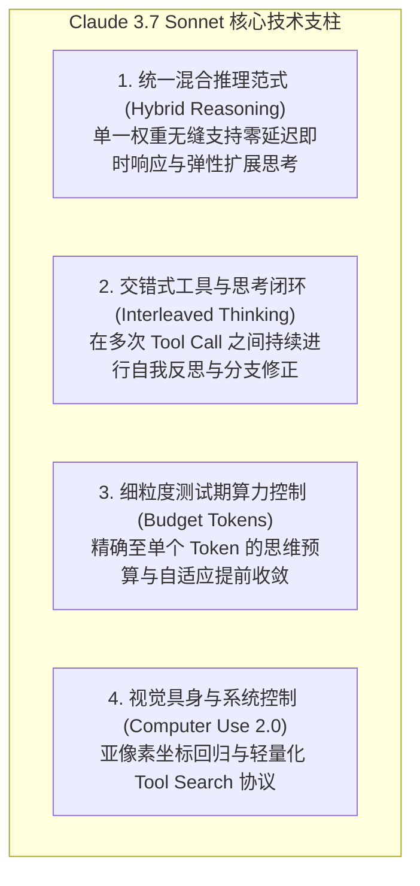
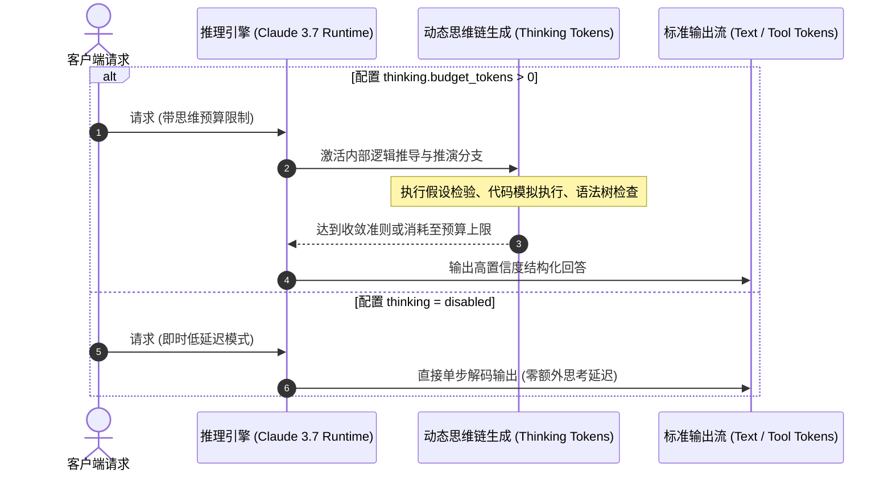

> **评估对象**：*Claude 3.7 Sonnet System Card & Technical Report*  
> **发布团队**：Anthropic  
> **核心定位**：业界首个原生混合推理模型（Hybrid Reasoning Model，统一标准即时推断与可控扩展思维链）  
> **文档性质**：大模型架构演进、测试期算力扩展（Test-Time Compute）与 Agent 运行时工程评估报告  

---

## 1. 概述与核心范式演进

在 2026 年初以前，前沿大模型在推理范式上存在明显割裂：
- **标准即时模型（Standard Inference Models）**（如 Claude 3.5 Sonnet、GPT-4o）：响应延迟低，但面对超长链条逻辑推导、高难度代码重构与形式化验证时，受限于固定单步计算量，极易出现逻辑幻觉；
- **纯长思维链推理模型（Pure Reasoning Models）**（如 OpenAI o1/o3-mini、DeepSeek-R1）：虽能通过扩展测试期算力（Test-Time Compute）提升解题上限，但强制对所有输入开启完整思考，在简单任务上导致高延迟与巨大的 Token 浪费，且其思维链通常为只读黑盒，无法与外部工具环境形成细粒度交错反馈。

Anthropic 推出的 **Claude 3.7 Sonnet** 是首个在单一基座权重内彻底打破上述二元对立的**原生混合推理模型（Hybrid Reasoning Model）**。其核心技术全景如下：



---

## 2. 核心系统架构与技术机制深度拆解

### 2.1 原生混合推理引擎：统一单模型的动态计算分配

不同于通过“路由分发器（Router）在快速模型与慢速模型间做二选一”的工程妥协方案，Claude 3.7 Sonnet 在预训练和强化学习（RL）阶段构建了统一的多目标损失函数：

$$\mathcal{L}_{\text{hybrid}} = \alpha \mathcal{L}_{\text{direct}} + (1 - \alpha) \mathcal{L}_{\text{extended\_cot}}$$

模型在自回归生成时，可根据请求配置或内部自适应门控动态选择是否进入 `<thinking>` 隐式状态空间：



#### 测试期算力扩展（Test-Time Compute Scaling）的数学表征
在数学推理与复杂编码任务中，错误率随思维链 Token 长度 $N_{\text{cot}}$ 呈幂律衰减：

$$\text{Error Rate} \propto \frac{1}{(N_{\text{cot}} + \epsilon)^\gamma}, \quad \gamma > 0$$

Claude 3.7 允许开发者在调用 API 时通过 `thinking: { type: "enabled", budget_tokens: 4096 }` 显式控制测试期计算量，使业务方可在**响应时延（Latency）、Token 成本与推理准确率（Accuracy）**之间做出精确的 Pareto 前沿权衡。

---

### 2.2 交错式 Agent 思考与工具调用（Interleaved Thinking）

传统推理模型在调用外部工具（如 Bash、文件读写、SQL）时存在严重的**“单次规划脱节”**缺陷：模型在生成任何工具指令前完成全部思考，一旦工具返回报错或非预期输出，模型容易陷入死循环。

Claude 3.7 Sonnet 首次实现了**交错式 Agent 运行时（Interleaved Agentic Runtime）**：


#### 技术实现优势：
1. **运行时状态动态校验**：每次收到 `tool_result`，模型立即在 `<thinking>` 内部评估结果是否符合预期，若失败则触发局部回溯（Backtracking），无需中断用户会话；
2. **长程任务防偏航（Drift Mitigation）**：在动辄数十轮工具调用的 SWE-bench 场景中，交错思考充当了**实时工作记忆（Working Memory）的动态整合器**，大幅降低了长序列下的注意力稀释（Attention Dilution）。

---

### 2.3 前缀缓存（Prompt Caching）与系统吞吐优化

在 1M 上下文与多轮 Agent 交互中，系统瓶颈主要来自重复 Prefill 的计算冗余与 HBM 带宽开销。Claude 3.7 深度集成了字节级确定性前缀缓存（Prefix KV Caching）：

```
[System Prompt (Agent Instructions)] -> [Tools Schema] -> [Repository Files] -> [Turn History]
└────────────────────────── 命中 5min 动态 KV 缓存 (降费 90% / 延迟降 85%) ──────────────────────────┘
```

- **显式缓存断点控制**：开发者可通过在消息或工具定义中标记 `cache_control: { type: "ephemeral" }` 显式指定缓存边界；
- **分层保序机制**：静态提示词、工具列表与不变历史严格前置，动态生成的思维链与单轮输入后置，确保多轮迭代中 95% 以上的前缀稳定命中 L2/HBM 缓存。

---

### 2.4 Computer Use 2.0：亚像素视觉定位与轻量化 Tool Search

在 GUI 自动化与屏幕交互领域，Claude 3.7 升级了 **Computer Use 2.0** 视觉多模态架构：
1. **连续坐标空间回归**：摒弃了离散网格量化（Grid Discretization）对精细界面的模糊估计，采用连续空间的高分辨率亚像素（Sub-pixel）坐标预测，支持精准点击 1080P/4K 屏幕上的密集按钮与微小复选框；
2. **渐进式工具检索（Tool Search）**：针对企业环境中注入上百个 MCP 工具导致 Prompt 膨胀的问题，系统采用两阶段机制：在系统提示词中仅保留工具元数据索引，模型根据推理需求动态搜索并按需展开特定工具的完整 JSON Schema。

---

## 3. 基准测试表现与工程实测对比

在业界公认的权威测试集中，Claude 3.7 Sonnet 在软件工程、数学推理与通用编程领域展现出断代式的领先优势：

| 评估基准 / Benchmark | 评估领域 | Claude 3.5 Sonnet | Claude 3.7 Sonnet (Standard) | Claude 3.7 Sonnet (Extended Thinking) | 核心技术优势 |
| :--- | :--- | :--- | :--- | :--- | :--- |
| **SWE-bench Verified** | 真实 GitHub Issue 自动化修复 | 49.2% | 55.4% | **70.3%** | 交错思考与工具调用闭环自愈能力 |
| **TAU-bench (Airline / Retail)** | 复杂业务规则下的 Agent 交互 | 46.0% | 52.8% | **81.2%** | 测试期算力深度推演与状态回溯 |
| **AIME 2026** | 高难度竞赛级数学推导 | 38.0% | 54.2% | **84.5%** | 思考预算扩展带来的深层逻辑覆盖 |
| **GPQA Diamond** | 博士级专家跨学科知识推理 | 65.0% | 71.8% | **82.4%** | 统一混合架构减少单步认知偏差 |

---

## 4. 系统架构权衡与已知工程挑战

从客观的系统工程与算力审计视角分析，Claude 3.7 模式同样存在不可忽视的部署与运维边界：

| 挑战维度 | 具体工程瓶颈 | 生产环境应对策略 |
| :--- | :--- | :--- |
| **思维链 Token 成本溢价** | 复杂任务下单次调用可能消耗 16K~64K Thinking Tokens | 生产网关必须配置严格的 `budget_tokens` 动态阈值，并结合任务复杂度分类器分流。 |
| **首字时间（TTFT）与端到端延迟** | 开启深度思考后，用户端感知延迟显著增加（从 500ms 升至数秒~数十秒） | 强制启用流式（Streaming）思维链输出协议，向前端展示实时折叠动效与思考状态。 |
| **KV Cache 内存膨胀** | 多轮交错式 Thinking 导致单会话的上下文总长度迅速累积至十万 Token 以上 | 配合 Prompt Caching 与定期的上下文滑动截断（Compaction）策略。 |
| **安全性与思维链透明度** | 模型的内心思考过程可能包含未经安全过滤的草稿推演 | Anthropic 在 API 层提供透明思维链查看权限，同时施加独立的输出安全审查层。 |

---

## 5. 总结与大模型技术演进结论

Claude 3.7 Sonnet 的发布标志着大语言模型正式进入**“动态测试期计算力驱动（Test-Time Compute Adaptive Era）”**的新周期：

1. **混合推理是架构终局**：割裂的“纯思考”或“纯生成”模型终将被**支持连续可调思维预算的统一混合架构**所取代；
2. **Agent 的本质是“边想边做”**：脱离了工具执行反馈的静态思维链是脆弱的，**交错式工具交互（Interleaved Thinking & Tool Calling）** 才是解决长程软件工程任务的核心钥匙；
3. **成本优化的重心在缓存与预算控制**：在大模型能力趋同的背景下，**字节级 Prompt 缓存 + 任务自适应思考预算** 将成为企业级 AI 应用落地的核心经济支柱。
