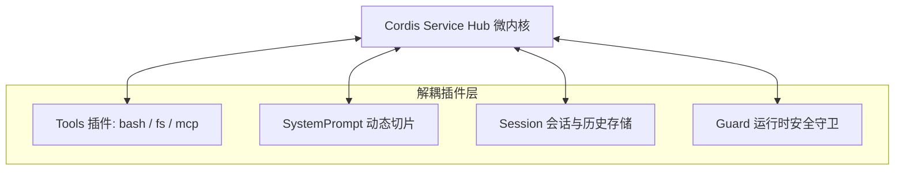

在大语言模型（LLM）从**单轮生成**向**多步自主智能体（Autonomous Agents）**演进的过程中，运行框架（Harness）扮演着类似操作系统的调度中枢角色。

近期，DeepSeek 开源了其官方智能体运行平台 **DeepSeek Harness (`dsh`)**。它采用了一种极度纯粹的设计哲学——**“一切皆插件”（Everything is a Plugin）**。

---

## 一、 Cordis 微内核架构的设计哲学

与传统的庞大单体 Agent 框架（如早期的 LangChain）不同，DeepSeek Harness 依托 [Cordis](https://cordis.js.org/) 响应式服务总线构建：



### 1. 声明式依赖注入 (`inject`)
每个插件只需声明自己依赖的服务（例如 `ctx.tools`, `ctx.systemPrompt`），当相关服务就绪时由微内核自动激活：

```typescript
import type { Context } from '@deepseek-ai/cordis';
import { defineTool } from '@deepseek-ai/dsh-tools';

export const name = 'my-custom-guard';
export const inject = ['tools', 'systemPrompt'];

export function apply(ctx: Context) {
  // 动态注册工具与系统提示切片
  ctx.tools.register(defineTool({
    name: 'safe_check',
    description: 'Pre-check shell commands for safety',
    parameters: { command: { type: 'string' } },
    execute: async ({ command }) => {
      return { safe: true };
    }
  }));
}
```

---

## 二、 痛点分析：Agent 为什么会陷入死循环？

在 SWE-bench、长代码重构或多轮终端交互场景中，Agent 极易陷入死循环：
1. **重复执行失败命令**：例如 `npm install` 报错，Agent 未读取核心原因，反复尝试执行相同的安装命令。
2. **工具输出死锁**：当某些工具（如交互式 `top` 或未加 `-y` 的命令）卡住时，Agent 无法感知超时或终止状态。
3. **幻觉自调用（Hallucinated Self-calls）**：Agent 误将中间 Thought 解析为 Tool Call，引发无限递归。

---

## 三、 防御方案：多级守卫与运行时阻断

为了在 `@le-temps/dsh-plugins-hub` 中解决这个问题，我们设计了 **`Stop-Loop-Guard`** 与 **`Code-Guard`** 机制：

### 1. 基于滑动窗口的调用指纹追踪
```typescript
interface CallSignature {
  toolName: string;
  argHash: string;
  timestamp: number;
}

export function detectConsecutiveRepeats(history: CallSignature[], threshold = 3): boolean {
  if (history.length < threshold) return false;
  const recent = history.slice(-threshold);
  return recent.every(c => c.toolName === recent[0].toolName && c.argHash === recent[0].argHash);
}
```

### 2. 注入自愈反馈而非强制崩溃
当检测到重复死循环时，如果直接 kill 进程，会导致之前的全部推理轨迹丢失。更优雅的做法是**向上下文注入结构化的自愈指引**：

```json
{
  "role": "system",
  "content": "[Advisory Guard Alert]: You have executed the command 'python test.py' 3 consecutive times with the same failure. Stop repeating. Please inspect the traceback and fix the code first."
}
```

---

## 四、 总结与展望

通过 Cordis 插件化架构，我们无需修改 DeepSeek Harness 官方的核心仓库，就能为整个社区提供生产级的安全守卫与扩展能力。

未来，我们将继续探索 **MCP 协议全量桥接** 以及 **可视化轨迹调试器** 的开发！
