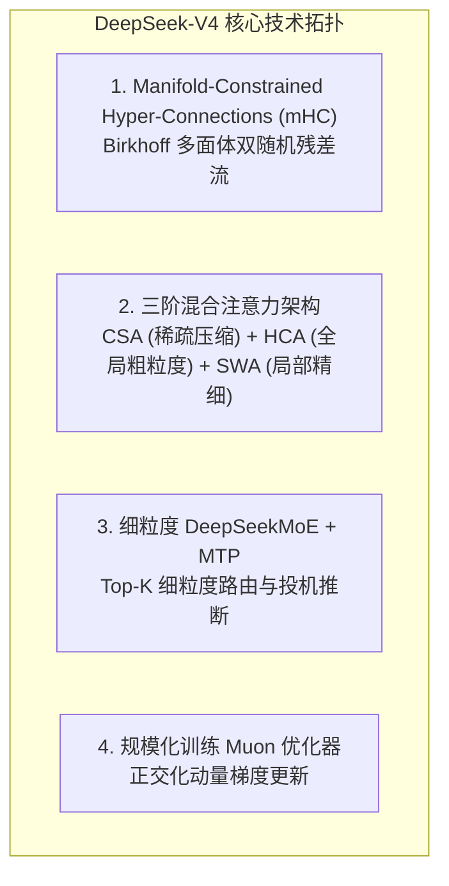
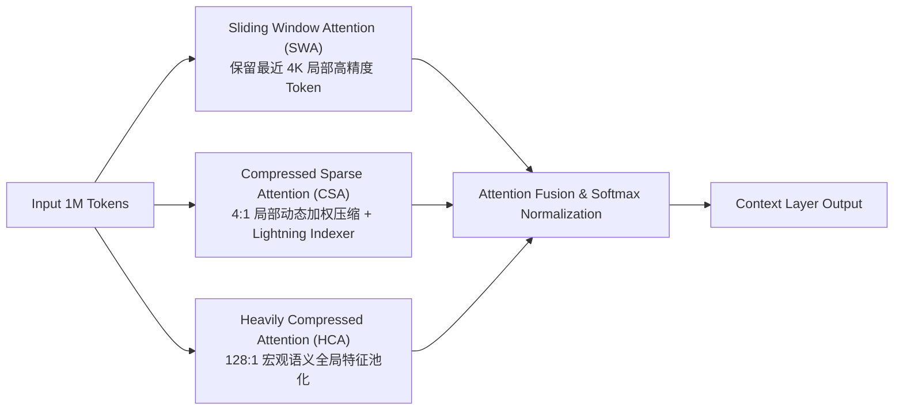
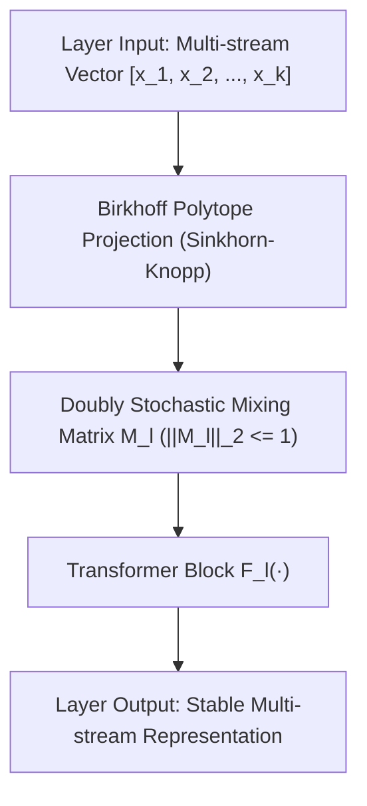

> **评估对象**：*DeepSeek-V4: Towards Highly Efficient Million-Token Context Intelligence* (arXiv:2606.19348)  
> **发布团队**：DeepSeek-AI  
> **模型版本**：DeepSeek-V4-Pro (1.6T MoE / 49B Active) / DeepSeek-V4-Flash (284B MoE / 13B Active)  
> **文档性质**：系统架构深度解构、算力效率审计与工程实现评估报告  

---

## 1. 核心设计目标与模型规格矩阵

随着大语言模型在软件工程与自主 Agent 场景的落地，推理上下文长度从 8K/32K 急剧扩展至 100 万（1M）Tokens。在传统 Transformer 架构中，长序列推理面临两项致命的系统级瓶颈：

1. **KV Cache 显存爆炸（Memory Capacity Bound）**：传统 MHA/GQA 的 KV 缓存显存占用随序列长度 $L$ 线性增长。在 1M 上下文下，单 Batch 推理的 KV Cache 即需要数百 GB 显存，导致单机并发容量骤降；
2. **长序列前向算力与延迟急剧恶化（Compute & Bandwidth Bound）**：自注意力计算复杂度为 $\mathcal{O}(L^2)$，导致长文档 Prefill 耗时不可接受。

DeepSeek-V4 在继承 DeepSeek-V3 细粒度专家（DeepSeekMoE）与多 Token 预测（MTP）的基础上，针对序列维度进行了彻底重构，其核心规格如下表所示：

| 参数项 | DeepSeek-V3.2 | DeepSeek-V4-Flash | DeepSeek-V4-Pro |
| :--- | :--- | :--- | :--- |
| **总参数量 (Total Params)** | 671B | 284B | **1.6T (1600B)** |
| **单步激活参数 (Active Params)** | 37B | 13B | **49B (约 3.06%)** |
| **原生上下文窗口 (Context Window)** | 128K | **1M (1048K)** | **1M (1048K)** |
| **注意力架构** | MLA (Multi-Head Latent) | **CSA + HCA + SWA 混合注意力** | **CSA + HCA + SWA 混合注意力** |
| **主干网络连接** | 恒等残差 (Identity Residual) | **流形约束超连接 (mHC)** | **流形约束超连接 (mHC)** |
| **优化器** | AdamW + FP8 Mixed | **Muon Optimizer** | **Muon Optimizer** |
| **1M 上下文 KV Cache 显存开销** | 100% (Baseline) | **~12%** | **~10%** |
| **1M 上下文 Prefill 计算 FLOPs** | 100% (Baseline) | **~24%** | **~27%** |



---

## 2. 序列维度压缩与三阶混合注意力架构

在 DeepSeek-V2/V3 中，MLA（Multi-Head Latent Attention）通过在**通道隐层维度**（Channel/Head Dimension）施加低秩投影压缩 KV Cache。然而，随着序列长度突破 1M，通道维度的压缩已达边际收益极限。

DeepSeek-V4 开创性地将压缩焦点由“通道维度”转向**“序列时序维度”**，提出了三阶交织的混合注意力体系：



### 2.1 Compressed Sparse Attention (CSA) 与 Lightning Indexer
CSA 并不直接在原始 Token 粒度上构建 KV，而是以固定窗口 $w=4$ 为粒度，通过数据自适应的加权注意力池化将 4 个相邻 Token 压缩为单个复合 Key-Value 表征：

$$\tilde{k}_j = \sum_{t=1}^w \omega_{j, t} k_{4j + t}, \quad \tilde{v}_j = \sum_{t=1}^w \omega_{j, t} v_{4j + t}$$

$$\omega_{j, t} = \frac{\exp(W_p x_{4j + t})}{\sum_{m=1}^w \exp(W_p x_{4j + m})}$$

在生成阶段，模型通过轻量级 **Lightning Indexer** 快速评估 Query 与历史压缩块的相关性得分，仅对 Top-$K$ 相关的历史压缩块执行稀疏注意力展开，避免了全量序列矩阵扫描。

### 2.2 Heavily Compressed Attention (HCA) 与 Sliding Window Attention (SWA)
- **HCA (128:1)**：以 128 个 Token 为块执行均值/交叉注意力汇聚，生成极度紧凑的长距离全局全景向量，确保模型不丢失文档级宏观语义；
- **SWA (4K Window)**：对最近的 4096 个 Token 维持未压缩的高保真 MHA/MLA 计算，保障局部语法、标点与代码近邻符号的精确关联。

**系统级收益**：在 1M 上下文的实际部署中，该体系将 KV Cache 显存占用直接砍去 **90%**，同时长文本端到端 Prefill 阶段的算力消耗降低 **73%**。

---

## 3. 流形约束超连接（mHC, Manifold-Constrained Hyper-Connections）

在超过 100 层的超深网络训练中，传统的单通道恒等残差连接（$x_{l+1} = x_l + F_l(x_l)$）限制了层间信息的多路表达能力。此前学术界提出的 Hyper-Connections（多流残差）试图将残差扩展为 $k$ 个并行流，但会导致深层网络的**信号能量爆炸与梯度失控**。

DeepSeek-V4 提出了 **流形约束超连接 (mHC)**，在数学上严格保证了多流残差的数值稳定性。



### 3.1 理论推导：Birkhoff 多面体与双随机矩阵约束
设第 $l$ 层的多流隐层状态为 $\mathbf{X}_l \in \mathbb{R}^{k \times d}$（包含 $k$ 个并行残差流）。mHC 引入可学习的流间混合矩阵 $\mathbf{M}_l \in \mathbb{R}^{k \times k}$：

$$\mathbf{X}_{l+1} = \mathbf{M}_l \mathbf{X}_l + \mathbf{W}_{\text{out}} F_l(\mathbf{W}_{\text{in}} \mathbf{X}_l)$$

为了防止特征范数随层数 $L$ 指数级发散，mHC 强制将混合矩阵 $\mathbf{M}_l$ 约束在 **Birkhoff 多面体 $\mathcal{B}_k$（即所有非负双随机矩阵的集合）** 之上：

$$\mathcal{B}_k = \left\{ \mathbf{M} \in \mathbb{R}^{k \times k} \ \middle|\ \mathbf{M}_{ij} \ge 0, \ \sum_{j=1}^k \mathbf{M}_{ij} = 1, \ \sum_{i=1}^k \mathbf{M}_{ij} = 1 \right\}$$

### 3.2 谱范数稳定性定理
根据 Perron-Frobenius 定理与 Birkhoff-von Neumann 定理，任意双随机矩阵 $\mathbf{M} \in \mathcal{B}_k$ 的谱范数（最大奇异值）严格满足：

$$\|\mathbf{M}_l\|_2 = 1$$

这意味着多流特征在跨越任意百层前向传播时，**其能量增益有界且不退化**；反向传播时梯度矩阵乘积 $\prod_{l=1}^L \mathbf{M}_l^T$ 的谱半径同样恒为 1，从数学机理上根除了超深大模型的梯度爆炸与梯度弥散问题。

在工程实现中，模型通过在前向计算中嵌入可微分的 **Sinkhorn-Knopp 算法**，仅需 3-5 次行/列归一化迭代即可高效完成流形投影。

---

## 4. 优化器革新：Muon 规模化工程落地

在 1.6T 参数量级的大规模预训练中，传统 AdamW 优化器存在两项已知缺陷：
1. **二阶动量显存开销巨大**：维护每个参数的一阶与二阶矩需要消耗大量的 HBM 显存；
2. **更新步长与曲率失真**：在高维非凸损失面中，坐标轴维度的逐元素缩放容易引起参数矩阵正交性受损。

DeepSeek-V4 全面引入了 **Muon (Momentum Orthogonalized by Newton-Schulz)** 优化器：

$$\mathbf{G}_t = \beta \mathbf{G}_{t-1} + (1 - \beta) \nabla_{\mathbf{W}} \mathcal{L}_t$$

$$\mathbf{U}_t = \text{NewtonSchulz5}(\mathbf{G}_t)$$

$$\mathbf{W}_{t+1} = \mathbf{W}_t - \eta \mathbf{U}_t$$

```mermaid
sequenceDiagram
    autonumber
    participant GPU as Tensor Cores (FP8 / BF16)
    participant Opt as Muon Optimizer
    participant NS as Newton-Schulz Iteration Engine
    participant Mem as HBM Weight Store

    GPU->>Opt: 提交当步梯度 G_t
    Opt->>Opt: 计算动量累加 G_t = beta * G_{t-1} + (1-beta) * Grad
    Opt->>NS: 执行 5 阶 Newton-Schulz 矩阵正交化近似
    NS-->>Opt: 返回极分解近似正交更新矩阵 U_t (U^T U ≈ I)
    Opt->>Mem: 原子应用参数更新 W = W - eta * U_t
```

- **Newton-Schulz 快速正交化**：通过 5 阶矩阵多项式展开在 GPU Tensor Core 上纯矩阵乘法高效逼近极分解 $\mathbf{U} = \mathbf{G}(\mathbf{G}^T \mathbf{G})^{-1/2}$，避免了耗时的 SVD 分解；
- **训练收敛加速**：相比 AdamW，Muon 在保持同等算力预算下显著加快了 1.6T MoE 模型的损失收敛速度，并且展示出极强的训练吞吐稳定性。

---

## 5. 系统工程权衡与技术局限性剖析

从严谨的工程与系统视角审视，DeepSeek-V4 的技术路线在带来极高能效比的同时，也引入了明确的架构权衡：

| 维度 | 技术权衡 / 局限点 | 工程影响与应对方案 |
| :--- | :--- | :--- |
| **压缩注意力精度边界** | 4:1 CSA 与 128:1 HCA 属于非绝对无损的有损压缩 | 在极度依赖单个特殊字符（如高精度正则表达式匹配、逆向二进制分析）的任务中，若关键 Token 落在 CSA 压缩窗口内，存在局部召回下降风险，需依赖 SWA 窗口或混合补偿。 |
| **推理系统内核适配门槛** | 非传统 MHA 格式，需定制 Triton / CUDA 算子 | 主流推理引擎（如 vLLM, TensorRT-LLM, SGLang）需要针对 Lightning Indexer 与 CSA 解码开发专用核函数，开源社区的工程迁移周期长于标准 Llama 架构。 |
| **mHC 跨卡通信开销** | $k$ 并行残差流增加了隐层特征交换的数据量 | 在张量并行（TP）与流水线并行（PP）切分时，流间混合矩阵计算需谨慎设计通信拓扑，防止跨 GPU 节点通信掩盖计算时间。 |
| **超稀疏 MoE 负载倾斜** | 1.6T 总参数中仅激活 49B，极端提示词可能引发专家热点 | 依赖精准的无辅助损失（Auxiliary-loss-free）负载均衡策略，对高并发生产集群的动态 Batching 调度提出了极高要求。 |

---

## 6. 综合评述与技术演进结论

DeepSeek-V4 的开源技术报告清晰地勾勒了下一代前沿大模型的演化方向：

1. **从“堆砌参数与算力”转向“数学流形与序列维度的精细解耦”**：通过 **mHC（Birkhoff 双随机流形约束）** 与 **三阶混合注意力（CSA/HCA/SWA）**，DeepSeek 证明了在 1M 上下文规模下，模型无需牺牲推理经济性即可获得顶尖的智能上限；
2. **为开源社区树立了百万上下文推理的新工程基准**：在 1.6T 规模下将 1M 上下文 KV Cache 压缩至上一代的 **10%**、计算开销降低至 **27%**，为端侧及私有化高性价比集群部署奠定了坚实的技术底座。
