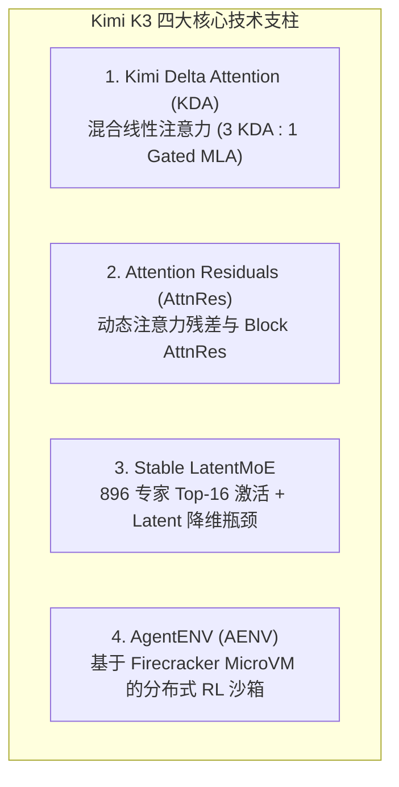
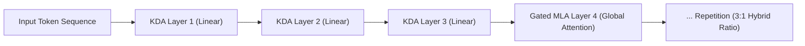
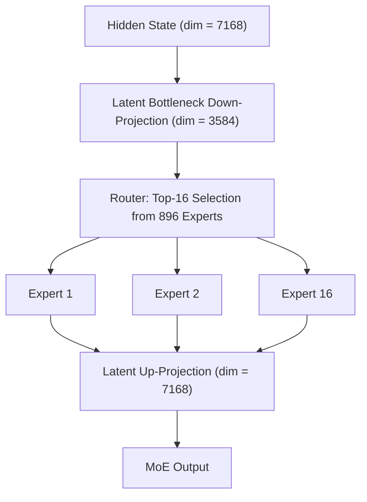
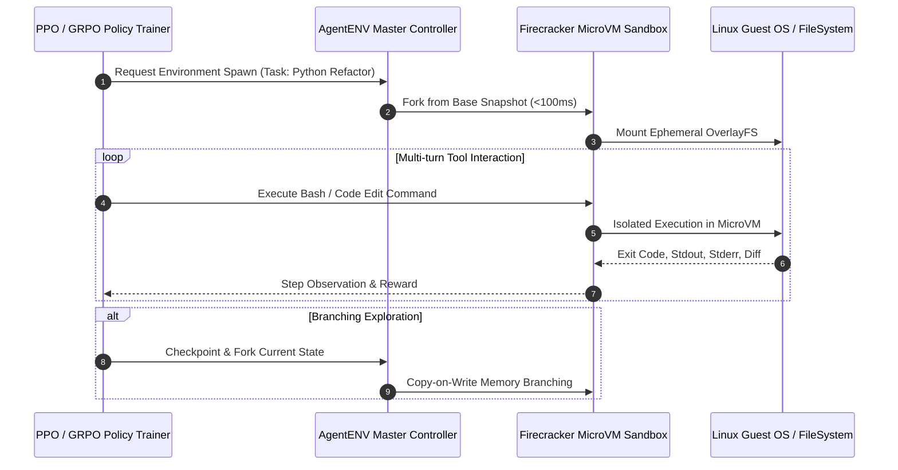

> **论文题目**：*Kimi K3: Open Frontier Intelligence*  
> **发布机构**：Moonshot AI (月之暗面)  
> **论文索引**：arXiv:2607.24653  
> **模型规格**：2.8 Trillion (2.8T) 总参数 / 104 Billion (104B) 激活参数 / 100 万 (1M) 上下文窗口  

---

## 1. 概述与核心定位

2026 年 7 月，月之暗面（Moonshot AI）正式发布并开源了其新一代超大规模旗舰基座大模型 —— **Kimi K3**。

作为全球首个突破 **3T 参数量级** 开源权重的大模型，Kimi K3 拥有 **2.8 万亿总参数**（采用稀疏 MoE 架构，单 Token 激活 **104B**），原生支持 **100 万（1M）Token** 超长上下文窗口与端到端多模态感知能力。

在工程与理论层面，Kimi K3 并没有沿用传统的“堆参数 + 稠密自注意力”范式，而是在长上下文注意力度量、深层网络信息流转、超稀疏 MoE 通信优化以及大规模 Agent 强化学习环境上完成了一整套深度创新。相比上一代 Kimi K2，其综合计算与推理效率提升了约 **2.5 倍**。

---

## 2. 核心架构技术深度拆解

### 2.1 Kimi Delta Attention (KDA)：打破 1M 上下文的显存墙

在标准 Transformer 的 Softmax 自注意力机制中，KV Cache 的显存占用随上下文长度线性增长：

$$\text{KV Cache Size} \propto \mathcal{O}(L \cdot D \cdot B)$$

当上下文扩展到 100 万 Token 时，仅 KV Cache 的存储就需要数十张 80GB H100/A100 显卡，导致推理阶段的显存墙与算力瓶颈急剧恶化。

Kimi K3 提出了 **KDA (Kimi Delta Attention)**，这是一种具备通道级遗忘门（Channel-wise Forget Gates）的混合线性注意力架构：

#### (1) Delta-Rule 状态递归方程
KDA 维护一个固定维度的隐藏状态矩阵 $S_t \in \mathbb{R}^{d_k \times d_v}$，其状态更新遵循精确的误差增量修正准则（Delta Rule）：

$$S_t = S_{t-1} \odot (1 - \beta_t \otimes \mathbf{1}) + \beta_t \left( v_t - S_{t-1} k_t \right) k_t^T$$

其中：
- $k_t \in \mathbb{R}^{d_k}, v_t \in \mathbb{R}^{d_v}$ 分别为当步的键与值向量；
- $\beta_t \in (0, 1)^{d_k}$ 为通道级学习遗忘率；
- $\left( v_t - S_{t-1} k_t \right)$ 表示当前值与历史预测值之间的“增量预测残差（Delta Error）”。

#### (2) 3:1 混合分层配比（KDA + Gated MLA）
纯线性注意力虽然具备 $\mathcal{O}(1)$ 的恒定推理显存，但在 Needle-in-a-Haystack（大海捞针）与超长精确检索任务中容易发生局部信息退化。

Kimi K3 采用了 **3:1 的周期性交织拓扑**：
- **每 3 层 KDA 线性注意力层**：负责全局长周期的低显存历史压缩与流式时序建模；
- **插入 1 层 Gated MLA（Multi-Head Latent Attention）全局注意力层**：负责高精度的精确关联与跨跨度全局检索。

这一设计使 1M 上下文推理时的显存占用直接降低了 **70% 以上**，同时在 Needle-in-a-Haystack 测试中实现了 100% 的无损召回。

---

### 2.2 Attention Residuals (AttnRes)：解决超深网络的表征退化

在包含数百层的现代超深大模型中，传统恒等残差连接（Identity Residual Connection）为：

$$x_{l+1} = x_l + F_l(x_l)$$

随着网络深度 $L$ 的不断叠加，早期层的关键特征会被上百个后续层的简单累加所“稀释”，同时容易出现隐层激活范数失控增长的现象。

Kimi K3 提出了 **Attention Residuals (AttnRes)**，将恒等加法残差改造为**跨层动态 Softmax 注意力聚合**：

$$x_{l+1} = \sum_{i=1}^l \alpha_{l, i} \cdot h_i + F_l(x_l)$$

$$\alpha_{l, i} = \frac{\exp(q_l^T k_i / \sqrt{d})}{\sum_{j=1}^l \exp(q_l^T k_j / \sqrt{d})}$$

#### Block AttnRes 分块优化
为了避免在全深度上计算注意力带来的通信与显存开销，K3 采用了 **Block AttnRes** 策略：
将整个网络的 $N$ 个层划分为若干个固定的 Layer Block（例如每 8 层为一个 Block），Block 内部保留密集注意力残差，Block 之间进行稀疏聚合，大幅降低了跨卡 All-Reduce 的带宽压力。

---

### 2.3 Stable LatentMoE：超高稀疏比与低通信开销

Kimi K3 采用了总计 **896 个微专家（Micro-Experts）**，每个 Token 仅路由激活 **16 个专家**，总参数 2.8T 中仅有 **104B（约 3.7%）** 参与单步前向传播。

#### (1) Latent Bottleneck 维度压缩
传统的 MoE 通信需要在 GPU 节点之间发送完整的模型隐层特征（$d = 7168$）。Kimi K3 在专家计算前引入了 **Latent Bottleneck 投影**，将隐层特征降维至 **$d_{\text{latent}} = 3584$** 后再发送至专家节点，**将跨节点 All-to-All 的通信流量直接削减了 50%**。

#### (2) 稳定性三剑客
超稀疏 MoE 在训练后期的梯度爆炸和负载坍塌一直是学术界难题，K3 引入了三项关键技术：
1. **RMSNorm Pre-projection**：在专家上投影矩阵前施加层归一化，限制特征范数；
2. **Bounded SiTU-GLU**：采用有界的激活函数，消除异常离群激活值（Outliers）；
3. **Quantile Balancing（分位数动态负载均衡）**：抛弃了传统的强约束 Auxiliary Loss（辅助损失常导致模型主任务损失劣化），改用基于动态分位数的路由偏置修正算法，实现了专家负载的零损耗均衡分配。

---

### 2.4 AgentENV：面向大规模 Agentic RL 的微虚拟化沙箱

对于以 Coding Agent、长程多步推理为主攻方向的 Kimi 系列，传统的静态数据集微调已无法满足需求。Kimi K3 报告中重点开源并解析了其 Agent 强化学习基础设施 —— **AgentENV (AENV)**。

- **Firecracker MicroVM 轻量级虚拟化**：每个环境具备独立的 Linux 内核、网络栈与文件系统，彻底阻断代码逃逸；
- **<100ms 秒级快照与分支派生**：支持在强化学习策略搜索（如 MCTS 或多路径探索）过程中，随时对环境进行增量快照和 Copy-on-Write 分叉，极大加速了 PPO/GRPO 在长时复杂编程任务上的迭代速度。

---

## 3. 性能基准与能力表现

在官方报告公布的综合基准测试中，Kimi K3 在多项指标上达到或超越了业界顶尖闭源与开源模型水平：

| 测试基准 / Benchmark | 评估维度 | Kimi K3 (2.8T MoE) | 核心优势分析 |
| :--- | :--- | :--- | :--- |
| **MMLU-Pro / GPQA** | 高阶综合推理 | **Top-tier** | 超大参数量带来的涌现知识储备 |
| **SWE-bench Verified** | 软件工程真实 Issue 修复 | **Leading Level** | 得益于 AgentENV 的全沙箱真实环境交互强化学习 |
| **AIME 2026 / MATH 500** | 复杂数学竞赛推导 | **SOTA** | Attention Residuals 保障了超长链条逻辑推导的信息无损 |
| **Needle In A Haystack (1M)** | 百万上下文检索召回 | **100% Exact Recall** | 3:1 KDA + Gated MLA 混合注意力的无损全局视野 |

---

## 4. 总结与技术演进启示

Kimi K3 的技术报告为大模型架构演进提供了几条极其重要的前沿脉络：

1. **纯 Softmax Attention 的时代正在过去**：在 1M+ 超长上下文成为标配的当下，**混合线性注意力（如 KDA、Delta Rule）** 结合稀疏全局注意力的范式，已被证明能够在保持算力可控的同时实现顶尖的检索与推理精度；
2. **残差连接需要被重新定义**：超深网络需要动态的 **Attention Residuals** 来赋能模型跨层自由提取多尺度抽象表征；
3. **Agent 的胜负手在于环境基础设施**：大模型的推理与编码能力上限，越来越依赖于底层是否拥有像 **AgentENV** 这样高并发、低时延、真隔离的强化学习环境矩阵。

---

> **结语**：Kimi K3 的全面开源不仅推动了全球 3T 级模型权重的普惠，更在底层计算范式与系统工程上为开源社区提供了不可多得的宝贵资产。
