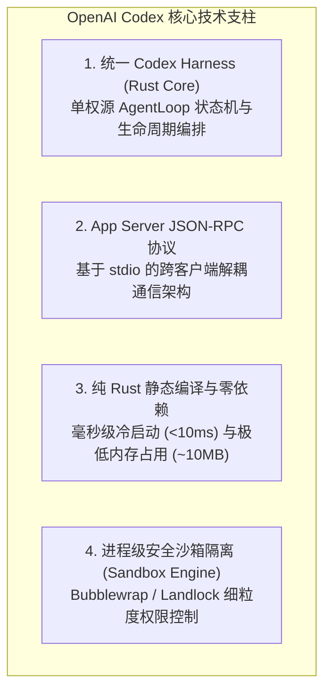
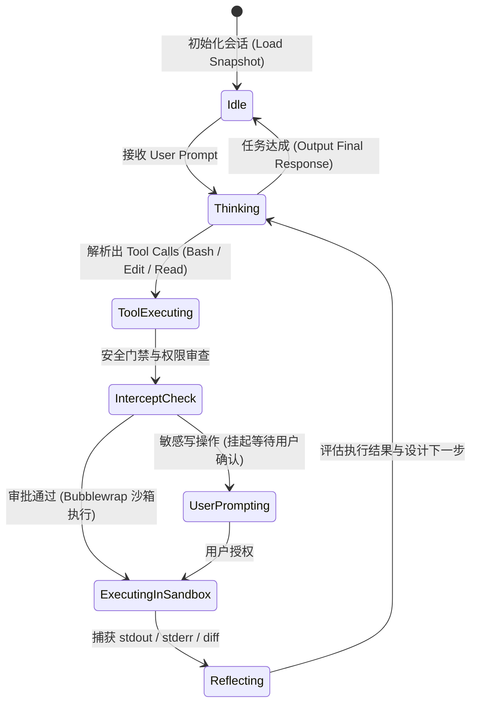
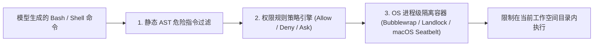

> **项目仓库**：[`openai/codex`](https://github.com/openai/codex) (Apache-2.0 License)  
> **核心语言**：Rust  
> **发布机构**：OpenAI  
> **文档性质**：开源项目底层系统架构解构、Agent Harness 状态机与通信协议工程评估报告  

---

## 1. 概述与核心演进背景

随着终端 Coding Agent 在大规模软件工程中的普及，传统基于 Node.js/Python 运行时构建的 Agent CLI 工具逐渐暴露出一系列系统级瓶颈：
- **启动冷时延高**：V8 引擎或 Python 解释器初始化耗时在 200ms~1000ms 之间，严重影响 CLI 的沉浸式交互；
- **运行时环境依赖脆弱**：依赖主机环境安装特定版本的 Node.js/NPM/Python，极易发生环境污染与依赖版本冲突；
- **多端逻辑分裂**：CLI、TUI、VS Code 插件与桌面端各自维护独立的 Agent 循环逻辑，导致状态一致性与特性同步成本高昂。

为了解决上述问题，OpenAI 正式将其开源终端编程 Agent 项目 **Codex（`openai/codex`）** 全面重构为**基于纯 Rust 构建的高性能、零依赖原生架构**。



---

## 2. 模块拓扑与分层架构

OpenAI Codex 采用了清晰的 Rust Cargo Workspace 多 Crate 解耦设计：

```text
codex/
├── crates/
│   ├── codex-core/        # 核心 Agent Harness 引擎 (AgentLoop, Session, Tool Registry)
│   ├── codex-protocol/    # 强类型 JSON-RPC 协议帧定义、序列化与事件规范
│   ├── codex-server/      # 基于 stdio/Unix Socket 的 App Server 进程服务
│   ├── codex-cli/         # 命令行 CLI 入口与非交互式批处理管道
│   ├── codex-tui/         # 基于 Ratatui/Crossterm 的高性能终端渲染界面
│   └── codex-sandbox/     # Linux/macOS 平台沙箱隔离与命令拦截层
├── Cargo.toml
└── README.md
```

### 系统数据流与架构拓扑

```mermaid
graph TD
    User["开发者 / 终端命令"] --> Client["客户端外壳 (codex-cli / codex-tui / IDE Extension)"]
    
    subgraph IPC_Layer [进程间通信层 (JSON-RPC over stdio)]
        Client <== "请求 / 响应 / 流式事件 (JSON-RPC)" ==> Server["Codex App Server (codex-server)"]
    end
    
    subgraph Core_Engine [Codex Harness 核心运行时 (codex-core)]
        Server --> Loop["AgentLoop 事件循环调度器"]
        Loop --> State["Session & Thread DAG 状态树"]
        Loop --> Compactor["Context Compactor (滑动压实与 Token 预算)"]
        Loop --> Tools["Tool Dispatcher (read, edit, write, bash)"]
        Tools --> Sand["Sandbox Runtime (Bubblewrap / Landlock)"]
    end
    
    Loop <== "LLM Streaming (SSE / HTTP2)" ==> Cloud["OpenAI Frontier API (GPT-5 / Reasoning Models)"]
    Sand <== "受限文件/命令操作" ==> OS["本地操作系统 / 文件系统 / Git"]
```

---

## 3. 核心机制深度剖析

### 3.1 统一 Codex Harness：单权源 Agent 状态机

在 `codex-core` 中，所有交互被抽象为由强类型事件驱动的 `AgentLoop` 状态机。无论前端是命令行单行指令、TUI 全屏交互还是 VS Code 侧边栏，底层均复用完全一致的 Harness 逻辑：



#### 会话 DAG 树形存储与无损回溯
会话历史采用不可变的 Append-only 树形结构存储：
- 每次会话分支（Branching）派生新节点，保留完整的父节点指针（`parent_id`）；
- 当用户执行回滚（Revert）或分支探索时，直接调整工作游标（Head Pointer），不破坏底层物理存储；
- 在上下文超出模型窗口时，触发 `ContextCompactor`，以无损保留 `<read_files>` 和 `<modified_files>` 累加标签的形式生成分段摘要。

---

### 3.2 跨端通信中枢：App Server JSON-RPC 协议

为了让外部 IDE（如 VS Code、Cursor、Neovim）及图形界面能够无缝集成 Codex，OpenAI 摒弃了私有二进制绑定，设计了基于标准输入输出（`stdio`）的 **JSON-RPC 2.0 异步双向协议**。

```json
// 客户端向 App Server 发送会话执行指令
{
  "jsonrpc": "2.0",
  "id": 42,
  "method": "thread/turn/start",
  "params": {
    "thread_id": "thr_01j7x8k2...",
    "prompt": "修复 src/lib.rs 中的生命周期编译报错并运行 cargo test",
    "approval_mode": "auto_if_safe"
  }
}
```

```json
// App Server 向客户端流式派发执行状态事件
{
  "jsonrpc": "2.0",
  "method": "thread/event",
  "params": {
    "thread_id": "thr_01j7x8k2...",
    "event_type": "tool_execution_start",
    "tool_name": "bash",
    "command": "cargo test --lib"
  }
}
```

#### 协议解耦优势：
1. **单一事实来源（Single Source of Truth）**：所有工具执行、Token 统计、安全策略与上下文压实均在 Rust App Server 内闭环，客户端仅充当轻量视图层（Thin View Layer）；
2. **热升级与隔离性**：客户端与服务端运行于独立子进程中，App Server 崩溃不会导致 IDE 宿主崩溃，支持透明自动重启与状态断点恢复。

---

### 3.3 进程级安全沙箱隔离（Sandbox Engine）

在自动化执行模型生成的 Shell 脚本与文件修改时，代码注入与危险指令（如越权删除、网络外联）是最大的安全隐患。`codex-sandbox` 在系统层实现了严密的纵深防御体系：



- **Linux 平台**：通过 `Bubblewrap`（利用 Linux User/Mount Namespaces）挂载临时的只读根目录，仅对当前 Workspace 授予写权限，并利用 `seccomp` 过滤危险系统调用；
- **macOS 平台**：调用内核级 `sandbox-exec` 与 Seatbelt 策略脚本，阻断未经授权的跨目录文件读写；
- **权限熔断模式**：对于涉及网络外联、全局环境修改（如 `npm install -g`）的操作，强制挂起并向客户端发送审批请求事件（`permission_request`）。

---

## 4. 业界前沿 Coding Agent 架构横向对比

| 架构维度 | OpenAI Codex (`openai/codex`) | Anthropic Claude Code | Pi Coding Agent |
| :--- | :--- | :--- | :--- |
| **底层开发语言** | **Rust (纯原生静态编译)** | TypeScript / Node.js | TypeScript / Node.js |
| **外部运行依赖** | **零依赖 (单二进制可执行文件)** | 需要 Node.js >= 18 | 需要 Node.js >= 20 |
| **启动冷延迟** | **< 10ms (极速秒启)** | ~300ms - 800ms | ~250ms - 600ms |
| **常驻内存开销** | **~10MB - 25MB** | ~120MB - 250MB | ~90MB - 180MB |
| **架构解耦模式** | **App Server (JSON-RPC over stdio)** | CLI 内嵌一体化 | SessionManager SDK / TUI |
| **沙箱隔离方案** | **原生 Bubblewrap / Landlock / Seatbelt** | 用户权限直接运行 | Project Trust 门禁 |
| **多端复用能力** | **跨 CLI / TUI / VS Code 统一复用** | 专注于终端 CLI | 专注于终端 TUI / SDK |

---

## 5. 总结与系统工程启示

OpenAI 对 Codex 架构的开源与 Rust 重构，为整个 Agent 基础设施生态树立了明确的技术演进标杆：

1. **Agent Harness 的系统级下沉**：随着大模型自身推理能力的提升，Agent 框架的竞争焦点正从上层提示词编排转移至**底层的系统性能、内存开销、强类型生命周期管理与安全沙箱**；
2. **Rust 正在成为 Agent 基础设施的标准底座**：通过静态编译消除环境依赖，借助零成本抽象保障并发安全，使 Agent 能够以极高吞吐无缝嵌入各类生产流水线与 CI/CD 自动化系统；
3. **App Server 协议解耦是多端统一的必由之路**：将核心调度引擎与交互界面通过标准化 JSON-RPC 彻底分离，极大地释放了生态集成效率。
