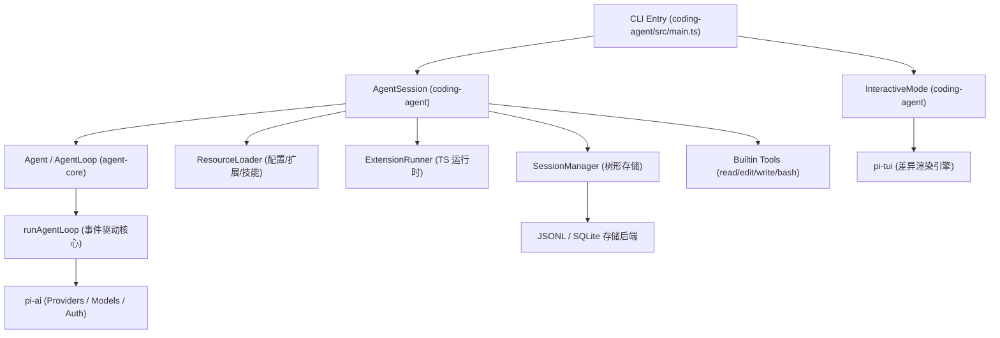
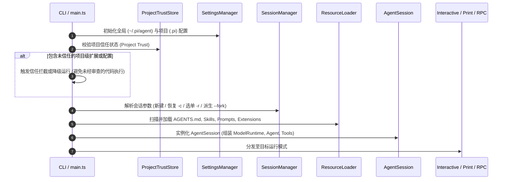

> **作者/团队**：Earendil Works (Mario Zechner, Armin Ronacher 等)  
> **项目源码**：`@earendil-works/pi-coding-agent` (`pi-mono`)  
> **文档性质**：系统架构与工程实现评估报告

---

## 1. 概述与核心定位

Pi 是一个面向软件工程场景的终端 AI Coding Agent 框架与运行时环境。其核心设计目标是提供轻量、高确定性、低上下文开销且可编程扩展的 Agent 基础设施。

系统未采用传统框架常见的黑盒多智能体编排（Multi-agent Orchestration）、内置计划模式（Plan Mode）或重型 RPC 协议（如默认 MCP 客户端），而是基于标准 Unix 理念，将模型与本地操作系统的交互收敛为一组基础原子工具（`read`, `edit`, `write`, `bash`），并通过强类型的 TypeScript 扩展系统提供全生命周期 Hook。

系统支持四种接入与运行模式：
- **Interactive TUI**：基于终端虚拟缓冲区的全功能交互界面。
- **Print / JSON Mode**：标准输入输出管道批处理模式，支持流式 JSONL 事件输出。
- **RPC Mode**：基于行分隔 JSON 协议的进程间通信模式，供宿主环境集成。
- **SDK Mode**：Node.js / Bun 运行时内嵌 API。

---

## 2. 代码组织与模块分层

Pi 采用 Monorepo 架构进行解耦，主要包划分如下：

```text
pi/packages/
├── ai/                # @earendil-works/pi-ai
│                      # 统一 LLM API 适配层、Token/成本统计与鉴权管理
├── agent/             # @earendil-works/pi-agent-core
│                      # AgentLoop 事件循环、状态管理与持久化 Harness 状态机
├── coding-agent/      # @earendil-works/pi-coding-agent
│                      # CLI 入口、内置工具、会话持久化、压实与扩展加载器
├── tui/               # @earendil-works/pi-tui
│                      # 虚拟终端缓冲区、差异化渲染引擎与基础组件库
├── protocol/          # @earendil-works/pi-protocol
│                      # IPC 通信协议定义、CBOR/JSON 编解码与帧处理
├── client/ & server/  # 客户端与服务端通信套接字实现
└── session-backends/  # 会话存储后端适配器 (如 SQLite)
```

### 依赖关系与数据拓扑



---

## 3. 运行时生命周期与执行流转

### 3.1 启动与初始化时序



### 3.2 单轮 Prompt 执行与工具循环

```mermaid
sequenceDiagram
    autonumber
    actor User as 用户
    participant Session as AgentSession
    participant Loop as runAgentLoop (agent-loop.ts)
    participant AI as pi-ai (streamSimple)
    participant ToolPipeline as 工具调度流水线
    participant Storage as SessionManager (JSONL)

    User->>Session: prompt(text, images)
    Session->>Loop: runAgentLoop(messages, context, config)
    Loop->>Session: emit: agent_start, turn_start
    
    loop Turn 执行周期 (直到无 Tool Call 或触发终止条件)
        Note over Loop: 1. 消费 Steering 队列 (若有插话消息，优先追加)
        Loop->>AI: 发送 LLM 请求 (执行 transformContext 与 convertToLlm)
        
        loop Stream 流式接收
            AI-->>Loop: text_delta / thinking_delta / toolcall_delta
            Loop-->>Session: emit: message_update (TUI 进行局部增量渲染)
        end
        
        AI-->>Loop: Stream 结束，返回完整 AssistantMessage
        Loop->>Storage: 持久化 AssistantMessage
        
        alt 包含 Tool Calls
            Loop->>ToolPipeline: 预检与执行工具
            ToolPipeline->>ToolPipeline: 执行 beforeToolCall 钩子 (可阻断/篡改参数)
            ToolPipeline->>ToolPipeline: 执行工具实体 (文件读写 / 子进程命令)
            ToolPipeline->>ToolPipeline: 执行 afterToolCall 钩子 (结果与图片标准化)
            ToolPipeline-->>Loop: 返回 ToolResultMessage[]
            Loop->>Storage: 持久化 ToolResultMessage
            Loop-->>Session: emit: turn_end
        else 无 Tool Calls
            Loop-->>Session: emit: turn_end
        end
    end

    Note over Loop: 2. 检查 Follow-up 队列
    alt 存在排队消息
        Loop->>Loop: 将排队消息作为新 Prompt 开启新 Turn
    else 无排队消息
        Loop-->>Session: emit: agent_end
    end

    Session->>Session: 执行自动压实评估 (shouldCompact)
```

---

## 4. 核心系统实现机制

### 4.1 会话管理与 DAG 树形存储

在 `SessionManager.ts` 中，会话文件统一采用行分隔 JSONL 格式存储。每个条目（Entry）均包含 `id`（UUIDv7）和 `parentId`，在单文件内构成逻辑上的有向无环图（DAG）：

```text
[Header Entry]
  └── [User Entry (id: e1, parent: null)]
        └── [Assistant Entry (id: e2, parent: e1)]
              ├── [Tool Call A (id: e3, parent: e2)] ──> [Branch 1 Leaf]
              └── [Tool Call B (id: e4, parent: e2)] ──> [Branch 2 Leaf]
```

- **In-place Branching**：用户通过 `/tree` 命令可以浏览会话历史树，任意选择历史节点作为当前工作点切出新分支，所有历史记录与新分支保存在同一物理文件内，不产生数据覆盖。
- **Branch Summarization**：当从分支 A 切换至分支 B 时，系统自动计算二者的最近公共祖先节点（LCA），提取分支 A 的演进过程生成结构化 `BranchSummaryEntry` 注入分支 B，实现跨分支探索经验的保留。

### 4.2 上下文平滑压实与状态追踪

为解决模型有限上下文窗口溢出问题，`compaction.ts` 实现了非对称滑动压实策略：

1. **截断点定位（Cut Point Resolution）**：从当前最新消息反向累计 Token，保留满足 `keepRecentTokens`（默认 20,000 Tokens）的最近消息作为保留尾部（Retained Tail），以 `firstKeptEntryId` 作为分界点。
2. **超大单轮切分（Split Turn Handling）**：若单个 Turn 内部包含超量工具调用导致单轮超出预算，系统在 `assistant` 消息处切分，分别生成历史摘要与当轮前缀摘要，禁止在 `toolResult` 处非结构化断开。
3. **累加式文件操作追踪**：压实生成的摘要固定包含 `<read-files>` 与 `<modified-files>` 结构化标签，历史压实中的文件变更集合在后续压实中持续累加，防止长周期会话中模型丢失对项目触达文件的感知。
4. **双触发机制**：
   - **前置预测（Proactive）**：`contextTokens > contextWindow - reserveTokens` 时自动触发。
   - **后置恢复（Reactive Overflow Recovery）**：捕获 API 返回的 Context Window Exceeded 错误，触发即时压实并自动重试当轮操作。

### 4.3 异步双队列调度模型

在 `Agent` 类中维护了两个独立的消息队列，解决 Agent 长耗时执行期间的人机交互协作问题：

| 队列类型 | 触发方式 | 调度时机 | 典型应用场景 |
|---|---|---|---|
| **Steering 队列** | 运行中按 `Enter` | 在当前 Turn 的工具执行完成、下一轮 LLM 调用发起前**立即插入** | 观察到模型初期行为偏航时实时纠偏，终止后续无效工具调用 |
| **Follow-up 队列** | 运行中按 `Alt+Enter` | 在 Agent **完成所有工具调用、即将转入 Idle 状态前**追加 | 登记后续关联任务（如“当前功能重构完成后，补全单元测试”） |

### 4.4 事务化状态机与崩溃恢复（AgentHarness 2.0）

在 `packages/agent/src/harness/` 中，系统建立了三存储抽象（Three Stores）与副作用保护机制：

- **Entries**：写入即不可变（Write-once, Append-only）的树形历史节点。
- **Registers**：可覆盖/删除的强类型命名空间单元（存储程序计数器 `op.state`、当前 Lane 游标 `lane.leaf`）。
- **Usage Ledger**：只追加的成本与 Token 消耗流水账本。

```text
[Intent 事务提交]      写入 op.state = "executing_tool", 预留结果 entry_id = e_next
       │
[副作用执行区]         调用外部模型 API 或执行宿主 shell 命令 (断电/崩溃脆弱点)
       │
[Settlement 事务提交]  原子写入 entry(e_next), 更新 lane.leaf, 清理 op.state
```

**崩溃恢复判定规则**：
系统重启时读取 `op.state` 寄存器。若在副作用执行期间进程异常退出：
- 标记为 `replay: "safe"` 的只读类工具支持重放重试；
- 标记为 `replay: "never"` 的写操作与模型调用绝不重放，系统直接写入预留 ID 的合成中断错误节点，防止对代码库或计费接口产生二次破坏。

### 4.5 差异化终端渲染引擎（`pi-tui`）

不同于基于全屏刷新的终端库，`pi-tui` 自研了基于双缓冲区的差异渲染算法：
1. 内存中维护虚拟终端字符矩阵与 ANSI 属性矩阵；
2. 每次 UI State 变更时，计算前后两帧的矩阵 Diff，仅向 `process.stdout` 发送变更区间的 ANSI 光标位移与字符写入指令；
3. 启动时通过终端查询协商启用 Kitty Keyboard Protocol，实现 `Shift+Enter` 与修饰键的无损捕获，解决多行文本编辑的按键歧义。

### 4.6 扩展系统与沙箱信任模型

- **TypeScript 动态装载**：利用 `jiti` 运行时动态加载 `~/.pi/agent/extensions/` 与 `.pi/extensions/` 下的 TypeScript 文件，无需预编译。
- **Project Trust 门禁**：为防范克隆外部不可信仓库带来的投毒风险，首次打开包含项目级配置（`.pi/`）或本地技能的仓库时，系统强制挂起并弹出 Trust 确认。在获得显式授权前，禁止装载任何项目级可执行脚本。

---

## 5. 架构设计决策与权衡（Why）

### 5.1 协议选型：原生 CLI / Skills 对比 MCP

**决策**：默认不内置 MCP 客户端支持，核心操作依赖原生系统工具，复杂技能采用 [Agent Skills 标准](https://agentskills.io)（`SKILL.md`）。

**权衡分析**：
- **MCP 的实际开销**：全量暴露 MCP Server 会导致初始 Prompt 中注入数十个工具的完整 JSON Schema，单次交互即消耗上万 Prompt Token，同时长工具列表会分散模型注意力（Attention Dilution），增加工具误选率。
- **渐进式披露（Progressive Disclosure）**：Pi 仅向系统提示词注入 Skill 的名称与一句话描述（约数十 Token）。模型根据语义判断需要时，自主调用 `read` 工具读取 `SKILL.md` 细节并执行本地脚本。
- **行业验证**：Anthropic 官方后续在 2026 年针对 MCP 引入 `Tool Search` 机制，其自研的 Claude Code 核心层同样采用内置原子工具结合 `SKILL.md` 的架构，证明了避免全量注入工具 Schema 的必要性。

### 5.2 协作模型：单 Agent 状态流 对比 多 Agent 编排

**决策**：核心运行时仅维护单一主状态机，不内置预设的多智能体协作角色。

**权衡分析**：
- 多智能体网状通信增加了调试黑盒性与 Token 级联消耗；
- Pi 将多智能体需求降级为外部机制：开发者可在不同 `tmux` 窗口并行运行独立 Pi 进程，或通过 TypeScript 扩展调用 `AgentSession` SDK 进行显式编排。

### 5.3 文件修改模型：多区域精确替换 对比 全量重写 / Unified Diff

**决策**：自研 `edit` 工具，单次调用支持传入一组基于原文唯一匹配的不重叠替换块 `edits: [{ oldText, newText }]`。

**权衡分析**：
- **全量重写（Write）**：大文件输出 Token 消耗极大，模型在输出长文件时易产生逻辑省略（如用注释代替未修改代码）；
- **Unified Diff（Patch）**：模型在计算 Diff 行号元数据（`@@ -x,y +a,b @@`）时准确率不稳定；
- **Disjoint Exact Match**：模型仅需生成目标代码片段与替换内容，避免了行号推断与全量输出，单次调用支持跨函数多点修改，大幅降低了输出 Token 与往返轮次。

---

## 6. 性能与 Token 优化实现

### 6.1 Prompt Cache 稳定性保障

大模型厂商（如 Anthropic, OpenAI）的 Prompt Cache 依赖严格的**前缀字节级匹配（Prefix KV Cache）**。Pi 在工程实现上采取了以下保证措施：

```text
[System Prompt] -> [Global Config] -> [Skills Index] -> [Tool Definitions] -> [History...]
└──────────────────────── 严格静态有序前缀 (稳定命中缓存) ────────────────────────┘
```

1. **静态前缀保序**：系统提示词、全局扩展、Skill 目录与工具定义在会话生命周期内严格保序，禁止在提示词头部注入易变的时间戳或动态配置。
2. **后台任务隔离**：在执行压实总结或分支合并时，显式关闭 Cache 写入标记，防止低频单次总结请求污染主会话的 LRU 缓存空间。
3. **指标监控**：在状态栏实时输出 `CH`（Cache Hit Rate），低于阈值时记录 `CacheWaste`。

### 6.2 工具输出非对称截断

为防止调试命令产生海量日志撑爆上下文，系统在 `truncate.ts` 中设定了硬性阈值（默认 2000 行 / 50KB）：
- `read` 工具采用 `truncateHead` 保留文件起始内容；
- `bash` 工具采用 `truncateTail` 保留终端末尾输出（错误堆栈与测试断言主要集中在尾部）；
- `grep` 工具限制单行最长 500 字符，防范单行压缩代码污染上下文。

### 6.3 长度截断保护与执行熔断

当模型生成工具调用因触及 `max_tokens` 发生非正常结束（`stopReason === "length"`）时，流式 JSON 解析可能产生残缺参数。

在 `agent-loop.ts`（`failToolCallsFromTruncatedMessage`）中：
```typescript
if (message.stopReason === "length") {
    // 强制阻断当轮所有 Tool Call 执行，直接向模型反馈截断错误
    return await failToolCallsFromTruncatedMessage(toolCalls, emit);
}
```
该机制阻断了容错解析器尝试修复并执行不完整指令（如被截断的删除或写入命令）所带来的数据损坏风险。

---

## 7. 系统局限性与已知缺陷

| 维度 | 具体局限 | 技术影响与应对方案 |
|---|---|---|
| **安全与权限边界** | 默认无内置进程级沙箱，工具以启动用户全权运行 | 缺乏对恶意代码与 Prompt Injection 的主动阻断能力。生产环境必须配合 Docker 容器或微虚拟机（如 Gondolin）运行。 |
| **交互形式限制** | 纯 TUI / CLI 架构，缺乏主流 IDE 图形化集成 | 依赖终端键盘协议与快捷键，无 VS Code 原生内联 Diff 悬浮窗或点击式审批界面。 |
| **高级功能自理** | 核心不内置 Plan Mode、TODO 状态机或多角色编排 | 需要复杂工作流的团队需自行编写 TypeScript 扩展或集成 SDK。 |
| **长会话有损压实** | 结构化摘要对早期微观代码细节存在压缩损耗 | 极端复杂的长任务中，模型可能遗忘数十轮前的局部代码逻辑，需重新触发文件检索。 |
| **平台适配摩擦** | 深度依赖 Unix 终端与 Shell 行为 | Windows 原生环境（CMD/PowerShell）存在键位映射冲突（如 `Alt+Enter` 冲突）与路径格式差异，推荐在 WSL 下运行。 |
| **并发写约束** | 单会话绑定单一进程排他写锁（SQLite Lease） | 专为单兵本地开发设计，不支持多客户端在线协同编辑同一会话。 |

---

## 8. 总结与适用场景评估

Pi 在架构设计上体现了清晰的克制性与工程严谨度。通过将核心功能收敛为**基础原子工具 + DAG 树形会话 + 确定性 Prompt 缓存管理 + 状态机事务保护**，Pi 有效规避了工具冗余带来的 Token 膨胀与状态不一致问题。

### 适用场景：
- 追求极致 Token 成本控制与高缓存命中率的中大型代码库重构；
- 习惯终端、Vim/Neovim 与 Tmux 环境，需要会话分支回溯能力的工程师；
- 需要基于 SDK 构建轻量定制化 Agent 基础设施的系统级二次开发。

### 不适用场景：
- 依赖丰富 IDE 图形界面与点击式交互的新手开发者；
- 需要开箱即用企业级多人协同、RBAC 审计看板与多 Agent 自动化编排的团队。
